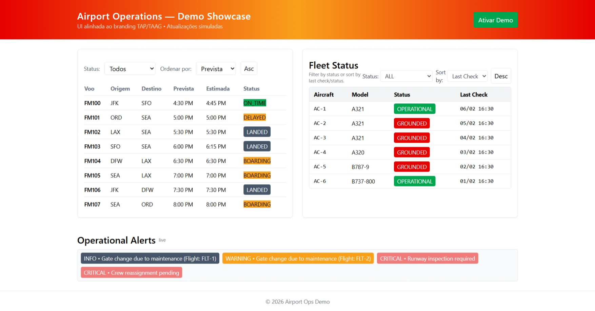

# ✈️ Airport Operations Dashboard

[](https://seu-projeto.vercel.app/?demo=true)
[](https://angular.io/)
[](https://nestjs.com/)

Um sistema completo de monitoramento de operações aéreas em tempo real, desenvolvido para demonstrar arquitetura limpa, padrões de projeto modernos e excelência em desenvolvimento Full Stack.

## 📸 Visão Geral

O projeto simula um ambiente de controle operacional de aeroporto, permitindo o monitoramento de voos, status de aeronaves e alertas críticos. O foco principal é a **robustez arquitetural** e a **experiência de desenvolvimento**.

| Dashboard de Voos | Detalhes da Frota |
|-------------------|-------------------|
|  | 
 |

> **Nota**: O sistema inclui um modo de demonstração (`?demo=true`) que utiliza dados estáticos para visualização imediata sem necessidade de backend local.

---

## 🚀 Destaques Técnicos

Este projeto foi construído seguindo as melhores práticas de engenharia de software, visando escalabilidade e manutenibilidade.

### Frontend (Angular 17)
- **Arquitetura Baseada em Sinais (Signals)**: Utilização dos recursos mais recentes do Angular para reatividade granular.
- **Design System**: Interface construída com **Tailwind CSS**, garantindo consistência e responsividade.
- **Gerenciamento de Estado**: Implementação limpa utilizando Services e RxJS para fluxos assíncronos complexos.
- **Componentização**: Estrutura modular com componentes isolados e reutilizáveis.

### Backend (NestJS)
- **Arquitetura em Camadas**: Separação clara entre Controllers, Services e Camada de Domínio.
- **Tipagem Forte**: Uso extensivo de TypeScript para garantir contratos de dados seguros (Interfaces e Enums para Voos, Aeronaves e Alertas).
- **Simulação Realista**: Engine de geração de dados que simula cenários operacionais dinâmicos.
- **Logging Estruturado**: Sistema de logs detalhado para rastreabilidade e debug.

---

## 🛠️ Tecnologias

- **Frontend**: Angular 17, TypeScript, RxJS, Tailwind CSS
- **Backend**: NestJS, Express, Node.js
- **Testes**: Jest (Unitários e E2E)
- **DevOps**: Configuração para Vercel (Serverless)

---

## 💻 Como Executar Localmente

### Pré-requisitos
- Node.js (v18 ou superior)
- npm

### 1. Backend (API)
O backend rodará na porta `3000`.

```bash
cd backend
npm install
npm run start:dev
```

### 2. Frontend (Aplicação)
O frontend rodará na porta `4200` e fará proxy automático das requisições para o backend.

```bash
cd frontend
npm install
npm start
```

Acesse: `http://localhost:4200`

---

## 🧪 Testes

A qualidade do código é garantida por uma suíte de testes abrangente.

```bash
# Testes Unitários (Backend)
cd backend && npm run test

# Testes E2E (Backend)
cd backend && npm run test:e2e

# Testes Unitários (Frontend)
cd frontend && npm run test -- --watch=false
```

---

## 🌐 Deploy

O projeto está configurado para deploy contínuo na Vercel.

- **Frontend Only**: Pode ser hospedado como SPA estático (usando o modo demo).
- **Full Stack**: O backend NestJS é adaptado para rodar como Serverless Function.

---

## 👤 Autor

Desenvolvido por **Dionísio Braga**.
*Engenheiro de Software focado em soluções escaláveis e arquitetura limpa.*

[LinkedIn](https://www.linkedin.com/in/dion%C3%ADsio-braga/) • [GitHub](https://github.com/JohnBraga45)
